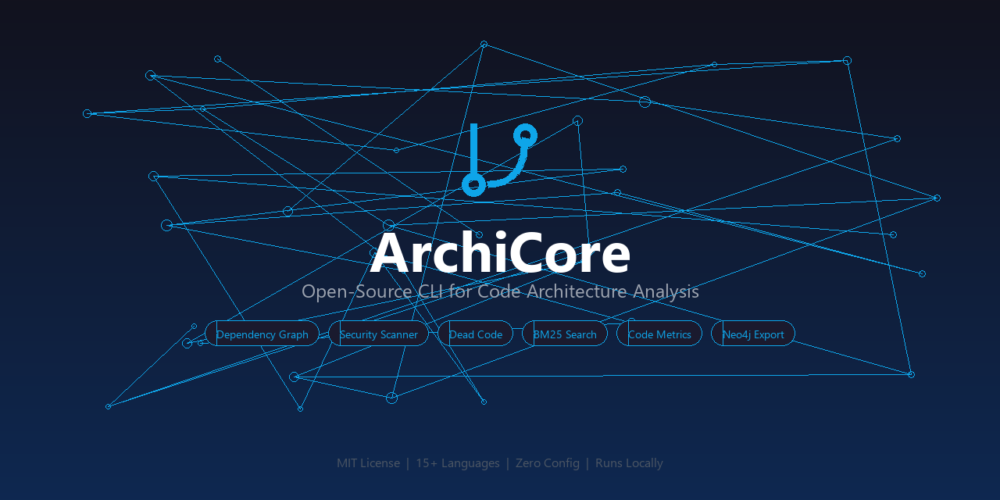
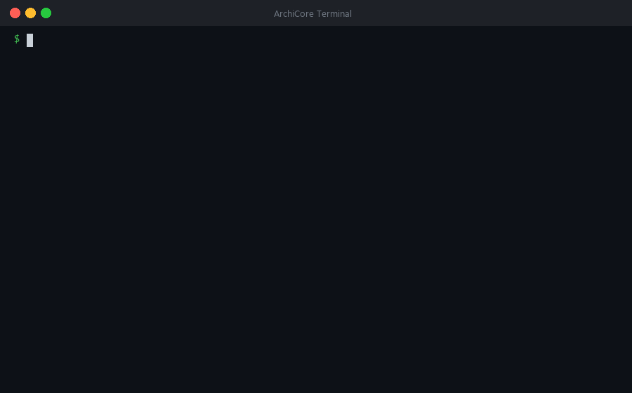
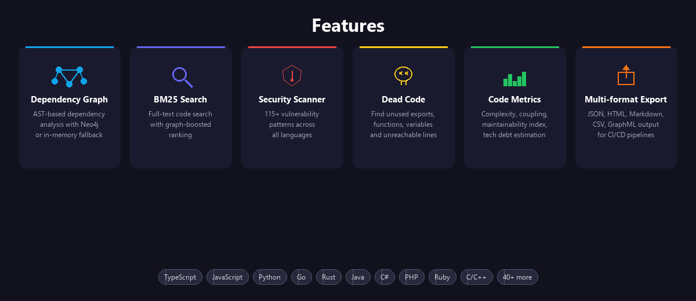
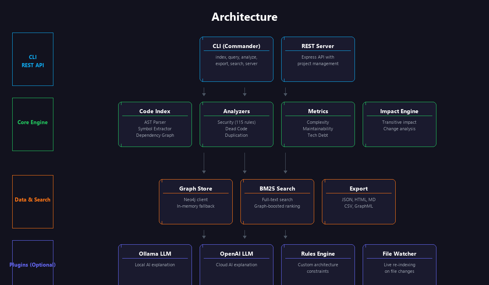

<p align="center">
  
</p>

<p align="center">
  <a href="#quick-start"></a>
  
  
  
  
</p>

<p align="center">
  Open-source CLI that analyzes code architecture, security, dead code, and dependencies.<br>
  No cloud. No config. One command.
</p>

---

## Demo

<p align="center">
  
</p>

## Features

<p align="center">
  
</p>

- **Dependency Graph** — AST-based dependency analysis with Neo4j storage (or in-memory fallback)
- **BM25 Search** — Full-text code search with camelCase/snake_case tokenization and graph-boosted ranking
- **Impact Analysis** — Transitive impact prediction for code changes
- **Code Metrics** — Cyclomatic complexity, coupling, maintainability index
- **Security Scanner** — 115+ vulnerability pattern detection across all languages
- **Dead Code Detection** — Find unused exports, functions, variables, and unreachable lines
- **Duplication Analysis** — Detect code clones
- **Architecture Rules** — Configurable rule engine for dependency constraints
- **Multi-language** — TypeScript, JavaScript, Python, Go, Rust, Java, C#, PHP, Ruby, and 40+ more
- **Multiple Export Formats** — JSON, HTML, Markdown, CSV, GraphML

## Why ArchiCore?

| Feature | ArchiCore | SonarQube | ESLint | Semgrep |
|---------|-----------|-----------|--------|---------|
| Runs locally | **Yes** | No (server) | Yes | Yes |
| Free & open-source | **Yes (MIT)** | Community ed. | Yes | Partial |
| Multi-language (15+) | **Yes** | Yes | JS/TS only | Yes |
| Dependency graph | **Yes** | No | No | No |
| BM25 code search | **Yes** | No | No | No |
| Dead-code detection | **Yes** | Limited | No | No |
| JSON / Neo4j export | **Yes** | API only | JSON only | JSON / SARIF |
| One-command setup | **Yes** | No | Config needed | Config needed |

## Quick Start

```bash
npm install
npm run build

# Index a project
archicore index /path/to/project

# Analyze everything
archicore analyze --all

# Query dependencies
archicore query deps src/index.ts
archicore query dependents src/utils/logger.ts
archicore query cycles
archicore query hubs

# Search code
archicore search "dependency graph"
archicore search --symbols "parseAST"

# Export results
archicore export json --output report.json
archicore export graphml --output graph.graphml

# Start REST API
archicore server --port 3000
```

## REST API

```bash
# Index a project
curl -X POST http://localhost:3000/api/projects/index \
  -H "Content-Type: application/json" \
  -d '{"rootDir": "/path/to/project"}'

# Graph queries
curl http://localhost:3000/api/graph/stats
curl http://localhost:3000/api/graph/dependencies/src/index.ts
curl http://localhost:3000/api/graph/dependents/src/utils/logger.ts
curl http://localhost:3000/api/graph/cycles
curl http://localhost:3000/api/graph/hubs
curl http://localhost:3000/api/graph/orphans

# Search
curl "http://localhost:3000/api/search?q=dependency"
curl "http://localhost:3000/api/search/symbols?q=parseAST"

# Analysis
curl http://localhost:3000/api/analysis/metrics
curl http://localhost:3000/api/analysis/security
curl http://localhost:3000/api/analysis/dead-code
curl http://localhost:3000/api/analysis/duplication
curl http://localhost:3000/api/analysis/rules

# Export
curl http://localhost:3000/api/export/json
curl http://localhost:3000/api/export/graphml
```

## Programmatic API

```typescript
import { ArchiCoreOSS } from 'archicore-oss';

const archi = new ArchiCoreOSS();
await archi.initialize();

// Index
await archi.indexProject('./my-project');

// Query
const deps = await archi.getDependencies('src/index.ts');
const impact = await archi.getImpact('src/core/parser.ts');

// Search
const results = archi.search('authentication');

// Analyze
const metrics = await archi.getMetrics();
const security = await archi.getSecurityIssues();

// Optional: LLM explanation
await archi.loadLLM('ollama');
const explanation = await archi.explainImpact(impact);

await archi.close();
```

## Neo4j (Optional)

For persistent graph storage and advanced queries:

```bash
# Start Neo4j
docker run -d --name neo4j \
  -p 7474:7474 -p 7687:7687 \
  -e NEO4J_AUTH=neo4j/password \
  neo4j:5

# Configure
cp .env.example .env
# Edit .env with your Neo4j credentials
```

Without Neo4j, ArchiCore uses an in-memory graph that works identically.

## LLM Plugins (Optional)

### Ollama (local, free)
```bash
# Install Ollama and pull a model
ollama pull llama3.1

# ArchiCore auto-detects running Ollama
archicore analyze --all --explain
```

### OpenAI
```bash
export OPENAI_API_KEY=sk-...
archicore analyze --all --explain
```

## Architecture

<p align="center">
  
</p>

## Contributing

See [CONTRIBUTING.md](CONTRIBUTING.md) for setup instructions, coding standards, and PR process.

## License

MIT
